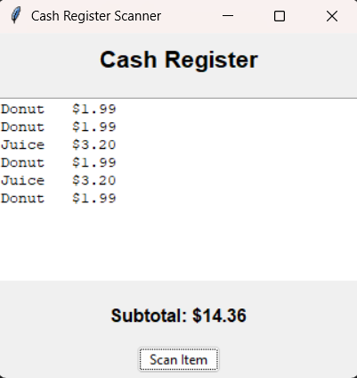

# Cash Register Application: Django ORM

This project implements a cash register application using Django's Object Relational Management (ORM) framework.

## Usage

- **Product Database**: Define product models in `db/models.py` with UPC code, name, and price
- **Scanning**: Running `main.py` uses tkinter for gui and allows you to scan products. Generate ongoing subtotal as you keep scanning products.
- **Database Queries**: Uses Django ORM queries in `main.py` to populate and retrieve product data

## Demonstration

Use the scan button to randomly scan products based on upc code. Ongoing subtotal is shown at the bottom of the window.

**Cash Register Application Window:**



## Setup Instructions

### Prerequisites
- Python 3.10.4 or higher
- pip package manager

### Quick Start

1. **Clone the repository**
   ```bash
   git clone <repository-url>
   cd assignment-3-django-and-energy-group-18-crn-43510
   ```

2. **Create a virtual environment and install dependencies**
   ```bash
   python -m venv venv
   source venv/bin/activate  # On Windows: .\venv\Scripts\activate
   pip install django
   ``` 

3. **Initialize the database**
   ```bash
   python manage.py makemigrations db
   python manage.py migrate
   ```

4. **Run the application**
   ```bash
   python main.py
   ```

## Project Structure

```
├── db/
│   ├── __init__.py
│   └── models.py          # Product model definition
├── main.py                # Simulate Cash Register
├── manage.py              # Django management script
├── settings.py            # Database configuration
└── README.md
```

## License

MIT License - See LICENSE file for details
